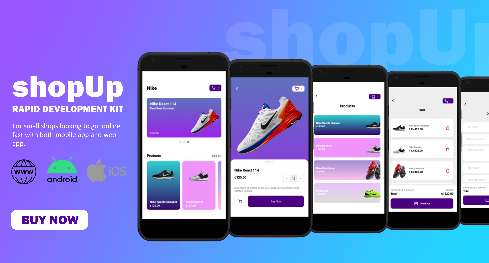

# shopUp e-commerce

This app is ideal for small creators or shops looking to sell their products online in unique way. With a simple UI, the app provides swift usage and very easily to navigate.
Give your customers the best with shopUp speed developemen kit.

## Screenshots


## Feathers
1. Five screens
2. Easy payment integration
3. Product carousel
4. Easy to configure and customize
5. Component based
6. Over-the-Air-updates

## How to set up
Upon purchasing this package, you will have all the source code which includes a ```config.js``` file where you can enter you shop details (name, etc) and a ```theme.js``` where you can customized the app (colors, font, etc).

### Development
The codes are well commented to allow other developers understand and edit the code.

To install:
1. run ```npm install``` or ```yarn install``` in the project directory to be alble to use it in developement.

To build:
1. install expo CLI on your computer.
2. In the project directory, run ```expo build:android``` to build an android APK or run ```expo build:ios``` to buils for iOS devices.

To update in production:
1. install expo CLI on your machine.
2. In the project directory, run ```expo publish``` to update using OTA updates.


## Terms of usage
The entity that purchase the package can not share copies of softwares containing our code to other third party entities such as other companies but are free to sell or distribute compiled software products to users and customers.